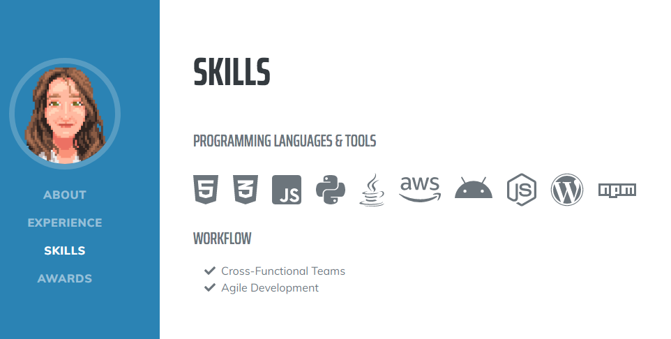

**July/August 2020 - Cloud Resume Challenge**

Built a [resume website](https://crehmzola.com) using AWS for the [Cloud Resume Challenge](https://cloudresumechallenge.dev/instructions/). Used S3 to deploy a static website, CloudFront and Certificate Manager for adding HTTPS, Route 53 for managing DNS, JavaScript to make a call to API Gateway, DynamoDB for storing website visitor count, Lambda for running Python code in a serverless function, an AWS Serverless Application Model (SAM) template for defining all of my Infrastructure as Code (IaC), GitHub for storing my back-end and front-end code, and GitHub Actions to deploy my code to AWS to create a full continuous integration/continuous deployment (CI/CD) pipeline.

Here's my [blog post](https://dev.to/crehmzola/the-silver-lining-in-the-cloud-resume-challenge-1j0h) recounting the experience.

